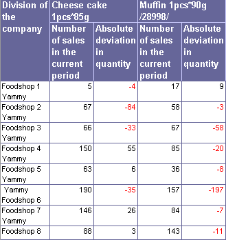
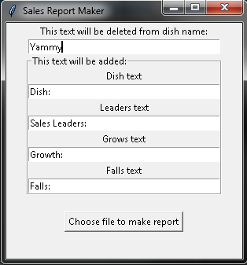

[](https://codeclimate.com/github/a-yanovskiy/Sales_Report_Maker/maintainability)
[](https://codeclimate.com/github/a-yanovskiy/Sales_Report_Maker/test_coverage)
[](https://github.com/a-yanovskiy/Sales_Report_Maker/actions/workflows/pyci.yml)

# Sales report generator

Sales Report Generator is a program, makes readable reports to send it to company massager.

## Example
Shop name is "Yammy". 
Program takes Excel report:



It cleans up dish names itself. '*_' brackets are needed to make dishes test italic and bold.
If you need to clean shop names, you can do this entering the word to be deleted in the input field.
To diversify the appearance of the report, you may enter "Dish", "Sales Leaders", "Growth sales" and "Falls sales", even add emojis.



Result:
```
Dish: *_Cheese cake_*
Growth: Foodshop 4: 55 pcs; Foodshop 7: 26 pcs; Foodshop 5: 6 pcs; Foodshop 8: 3 pcs; 
Falls: Foodshop 2: 84 pcs; Foodshop 6: 35 pcs; Foodshop 3: 33 pcs; Foodshop 1: 4 pcs; 
Sales Leaders: Foodshop 6: 190 pcs; Foodshop 4: 150 pcs; Foodshop 7: 146 pcs; Foodshop 8: 88 pcs; Foodshop 2: 67 pcs; Foodshop 3: 66 pcs; Foodshop 5: 63 pcs; Foodshop 1: 5 pcs; 

Dish: *_Muffin_*
Growth: Foodshop 1: 9 pcs; 
Falls: Foodshop 6: 197 pcs; Foodshop 3: 58 pcs; Foodshop 4: 20 pcs; Foodshop 8: 11 pcs; Foodshop 5: 8 pcs; Foodshop 7: 7 pcs; Foodshop 2: 3 pcs; 
Sales Leaders: Foodshop 6: 157 pcs; Foodshop 8: 143 pcs; Foodshop 4: 85 pcs; Foodshop 7: 84 pcs; Foodshop 3: 67 pcs; Foodshop 2: 58 pcs; Foodshop 5: 36 pcs; Foodshop 1: 17 pcs; 
```
